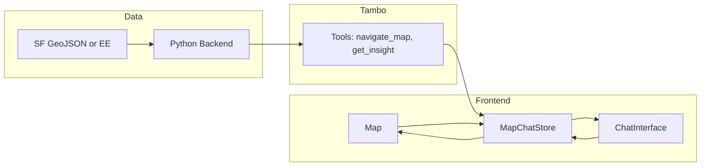

# Map–Chat Sync and Location/Region Insights

## Goals (from your target)

1. **Click on map** → Chat gets the point and provides insight (using feature data).
2. **Ask in chat** → Map flies to that location and chat explains.
3. **Select a region** → Chat knows which region and can describe it.
4. Use **Earth Engine** for data (and your existing SF GeoJSON + [geo.md](frontend/geo.md) as the feature/LLM reference).

## Current state

- **Map** ([Map.tsx](frontend/src/components/Map.tsx)): Static Mapbox, Detroit, no click handler, no layers, no shared state.
- **Chat** ([ChatInterface.tsx](frontend/src/components/ChatInterface.tsx)): Tambo thread/input only; no tools or components registered in [TamboProvider.tsx](frontend/src/providers/TamboProvider.tsx).
- **Data**: [sf_geospatial_agent_features_GUARANTEED_RUN.geojson](frontend/sf_geospatial_agent_features_GUARANTEED_RUN.geojson) is a single large FeatureCollection (Polygons) with properties: `ndvi`, `evi`, `ndbi`, `bsi`, `lst`, `elevation`, `slope`, `night_lights`, `fog_score`, `green_score`, `heat_score`, `region_id`. Matches [geo.md](frontend/geo.md) semantics.
- **Backend** ([backend/main.py](backend/main.py)): MCP-style `get_precomputed_data(region_name, metric)` only; not called from frontend. No Earth Engine in repo yet.

## Architecture (high level)

- **Shared store**: One place for “selected point”, “selected region” (bbox or feature id), “viewport” (lat, lng, zoom), and “current GeoJSON layer URL/id”. Map and chat both read/write this (React context or Zustand).
- **Map** subscribes to store: flyTo when viewport changes, highlight selection, draw region (rectangle or selected polygon).
- **Chat** (and AI) use **Tambo tools** that read/write the same store and optionally call the backend for EE/precomputed data.

---

## 1. Shared map–chat state

- Add a small **store** (e.g. React Context + useReducer, or Zustand) with:
  - `selectedPoint: { lng, lat } | null`
  - `selectedRegion: { type: 'bbox', bbox } | { type: 'featureId', id } | null`
  - `viewport: { longitude, latitude, zoom }` (for “chat drives map”)
  - Optional: `activeDataUrl: string | null` (which GeoJSON layer is on the map)
- Provide this at app level (e.g. above Map + Chat in [layout.tsx](frontend/app/layout.tsx) or [page.tsx](frontend/app/page.tsx)) so both Map and Chat (and Tambo tool runners) can access it.

---

## 2. Map: click, region selection, and layer

- **Point click**: On map click, set `selectedPoint` in the store (lng/lat from event). Optionally auto-send a short message to the thread like “Tell me about this location” with the coordinates (or rely on a “Get insight” button that sends the same).
- **Region selection**: Support at least one of:
  - **Draw rectangle**: Use Mapbox draw or a simple “draw bbox” mode; on finish set `selectedRegion: { type: 'bbox', bbox: [w, s, e, n] }`.
  - **Select grid cell**: If the SF GeoJSON is loaded as a layer, click on a polygon to set `selectedRegion: { type: 'featureId', id }` (and optionally store the feature’s properties for the AI).
- **GeoJSON layer**: Load the SF GeoJSON (or a backend-served URL) as a Mapbox Source + Layer (e.g. fill with color by `ndvi` or `green_score`). Keep the layer URL in the store so the AI and backend can refer to “current layer”.

Files to touch: [frontend/src/components/Map.tsx](frontend/src/components/Map.tsx), and a new store (e.g. `frontend/src/context/MapChatContext.tsx` or `frontend/src/store/mapChatStore.ts`).

---

## 3. Tambo tools so the AI can drive the map and get data

Register **Tambo tools** in [TamboProvider.tsx](frontend/src/providers/TamboProvider.tsx). Tools run in the frontend (or call your backend). Suggested tools:

- **navigate_map**  
  - Args: `latitude`, `longitude`, `zoom` (optional).  
  - Effect: Update store viewport; Map component reacts and flies to that location.
- **get_insight_at_point**  
  - Args: `longitude`, `latitude` (or “use current selection”).  
  - Logic: If you have the SF GeoJSON in memory (or a backend that does point-in-polygon), find the containing feature and return its properties (ndvi, lst, green_score, etc.).  
  - Return: Short structured summary + raw numbers so the model can verbalize using [geo.md](frontend/geo.md) guidance.
- **get_insight_for_region**  
  - Args: `bbox` (or “use current selection”) or `feature_id`.  
  - Logic: For bbox, filter features that intersect; for feature_id, return that feature’s properties. Optionally aggregate (e.g. mean ndvi, max lst).  
  - Return: Same style as point insight.
- **set_map_layer** (optional)  
  - Args: `dataUrl` or `region`, `metric`.  
  - Effect: Call backend `get_precomputed_data` (or future EE endpoint), get GeoJSON URL, put it in store; Map adds/updates the layer.

Tool implementation needs access to the store (and optionally to the loaded GeoJSON or backend). If Tambo tools are defined in the provider, pass the store (or a ref/setter) into the provider so tools can call it.

---

## 4. Injecting map context into the AI

- When the user **clicks the map** (or selects a region), either:
  - **Option A**: Append a system or user message with current selection, e.g. “User selected point (lng, lat)” or “User selected region: bbox/feature_id”, so the model has context and can call `get_insight_at_point` / `get_insight_for_region` (with “use current selection”) and then answer; or
  - **Option B**: On “Get insight” button click, call the insight tool yourself and then send the tool result plus a user message (“Describe this location”) so the AI only verbalizes.
- For **“take me to that location”** in chat: the model calls `navigate_map` with parsed coordinates (or place name → geocode first). So the AI must be able to invoke tools; ensure the system prompt in Tambo (or your backend) mentions these tools and when to use them (e.g. “When the user asks to go somewhere, call navigate_map. When they ask about a place or the current selection, call get_insight_at_point or get_insight_for_region.”).

Use [geo.md](frontend/geo.md) as the **system-prompt reference** for the AI: paste or summarize the “Interpretation” and “LLM guidance” sections so the model uses consistent language (e.g. ndvi &lt; 0.1 → “No vegetation”, heat_score &gt; 0.6 → “Heat-vulnerable”).

---

## 5. Backend and Earth Engine

- **Short term (no EE in repo yet)**:  
  - **Option A – Frontend-only**: Load the SF GeoJSON once (or by region) in the frontend; implement point-in-polygon and filter-by-bbox in the client for `get_insight_at_point` and `get_insight_for_region`. No backend call for insight; backend remains for “list/serve precomputed datasets” if needed.  
  - **Option B – Backend**: Add an endpoint, e.g. `POST /insight/point` and `POST /insight/region`, that accept lng/lat or bbox; backend loads the same GeoJSON (or a precomputed export from EE), does the lookup, returns properties. Tambo tools call this API.
- **Earth Engine**: When you’re ready to use EE for data:
  - Add **earthengine-api** (and auth) in the backend; expose endpoints that run EE computations (e.g. NDVI/LST for a point or region) and return the same property names as in [geo.md](frontend/geo.md) so the frontend and LLM stay unchanged.
  - Keep the same tool contracts: `get_insight_at_point` / `get_insight_for_region` can switch to calling EE-backed endpoints instead of GeoJSON lookup. The SF GeoJSON can remain as a fallback or for “precomputed layer” mode.

So: implement insight from **precomputed GeoJSON** first (SF file + geo.md); then swap or add EE behind the same API/tool interface.

---

## 6. Chat UI tweaks (optional but useful)

- **“Use this location” / “Use this region”** button next to the input when there is a selection: sends a message that includes the current selection so the AI knows to call the insight tools.
- Optional: Show a short “Selected: (lng, lat)” or “Region: …” in the sidebar so the user sees what will be sent.

---

## Suggested implementation order

| Step | What                                                                                                                        |
| ---- | --------------------------------------------------------------------------------------------------------------------------- |
| 1    | Add shared store (MapChatContext or Zustand) with selectedPoint, selectedRegion, viewport.                                  |
| 2    | Map: subscribe to viewport (flyTo), onClick → set selectedPoint, optionally add GeoJSON layer from URL in store.            |
| 3    | Map: add region selection (draw bbox or click-to-select polygon from loaded GeoJSON).                                       |
| 4    | Register Tambo tools: navigate_map, get_insight_at_point, get_insight_for_region (frontend GeoJSON lookup or backend stub). |
| 5    | Wire “click on map” to send context to chat (message or “Get insight” that triggers tools).                                 |
| 6    | Add geo.md summary to system prompt and test verbalization.                                                                 |
| 7    | Backend: optional /insight/point and /insight/region using SF GeoJSON; then tools call backend.                             |
| 8    | Later: EE integration in backend; same tool contracts.                                                                      |

---

## Clarifications that affect the plan

- **Region selection**: Do you want “draw a rectangle”, “click one grid cell” (SF polygon), or both? (Plan above supports both; we can narrow in implementation.)
- **Earth Engine**: Use EE only in the backend for live computations, or also need to “stream” EE tiles directly to the map? (Plan assumes backend EE for insight data; map layers stay GeoJSON or precomputed tiles for now.)
- **SF GeoJSON size**: The file is ~4.2M characters (single line). For frontend point-in-polygon you may want to either serve it from the backend and query by point/bbox, or load a simplified/smaller grid for the initial region to avoid heavy parsing on the client.

If you confirm these, the next step is implementing the store and Map click/viewport wiring, then Tambo tools and chat context injection.